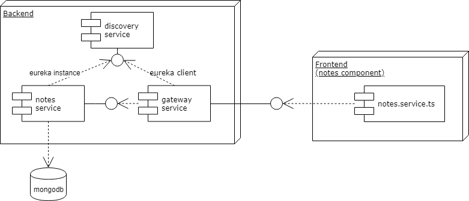

# Sample notes application
This is a sample application that supports creating Notes from an Angular frontend together with a Java/Spring based backend.

## Project and service structure
The project consists of 4 maven modules for all backend services as well as the frontend application:
- discovery-service
- gateway-service
- notes-service
- notes-frontend

The discovery-service provides service discovery functionality via netflix' eureka server.
The web-interface of the eureka server is exposed on port 8761 to be able to manually inspect the registered service(s).

The gateway-service provides an API gateway that is accessible at port 8080 and routes requests from :8080/notes to the notes-service.
It uses a eureka client to discover a notes-service instance.

The notes-service uses a eureka client to register itself with the discovery-service.
It registers a REST endpoint that handles POST requests on /.
The handler persists notes POSTed to that endpoint as mongodb documents and returns a `Created` (201) response.

The notes-frontend module contains the angular application source.

## Prerequisites
The following tools are required to build and run the backend services and frontend app:
- JDK 12
- docker (or a local mongodb instance)
- node/npm
- angular-cli (optional)
- maven

## Run frontend
For simplicity's sake the frontend is served via angular-cli's built-in development server.
Inside `notes-frontend/src/main/web` use `npm install` to install all node dependencies.

### Use globally installed angular cli
Use `ng serve` to build and serve the application, then browse to http://localhost:4200

## Use project's angular cli
Use `npm start` to build and serve the application and browse to http://localhost:4200

## Run backend
The backend requires a mongodb instance as well as running the 3 services in the maven modules.

### Run from source or JAR file
To run the backend services without docker or building JAR files you can run each service's
 main class from your favorite IDE.
The notes-service requires a mongodb instance on localhost:27017.

#### Build JAR files
To build JAR files and run them via `java -jar` use `mvn clean package` inside each of the 3 service's module folders.
The resulting JAR files are located in `target/<artifact-version>.jar`.

### Run as docker containers
In order to run the services inside docker containers the individual images need to be build
and then containers created from them.

#### Build Docker images
Build the individual images by running `mvn clean package` inside each of the 3 service's module folders.
This packages the services into JAR files and then creates a docker image based on the `Dockerfile` of each service.

#### Run via docker-compose
From the project's root (where the `docker-compose.yml` is located) run `docker-compose up` to start
a mongodb container as well as containers for the 3 services.

__TODO:__ Building the images from the docker-compose file by using the `build` instead of the `image` property 
together with `docker-compose build` produces corrupt JAR files. 
